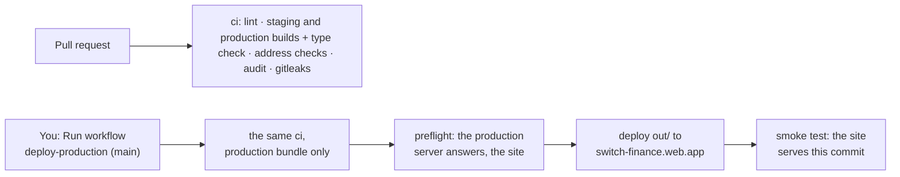

# Production: setup, CI/CD and deploys

Production is this dashboard built against the **production Parse server** (`api.switchfood.net`),
published at **https://switch-finance.web.app** (Firebase Hosting, project `switch-proj`). Finance
staff read real totals, exports and invoices on it.

**The rules**

- Only a **manual run of deploy-production from `main`** publishes production. Google enforces it:
  the deploy identity is only issued to a manual run from `main` of this repository (step 2). A
  merge publishes nothing.
- The production bundle is checked: `npm run build:production` refuses a bundle that names a
  staging or local server, or doesn't talk to `https://api.switchfood.net`.
- **Never test against production.** The numbers there are real money: try changes on staging, on
  seeded orders.
- `npm run deploy` from a laptop is no longer how production is published. It builds with whatever
  `.env.local` says, unchecked. The break-glass path is below.

---

## 1. How it works



- `.github/workflows/ci.yml` runs on every pull request and builds **both** bundles: staging with
  `.env.staging`, production with `.env.prod`. Each is refused if it can reach the other side's
  server.
- `.github/workflows/deploy-production.yml` runs only when you start it, on `main`. It runs the
  same checks for the production bundle, then deploys **the exact `out/` they built**.
- `.env.prod` (committed, nothing secret) is the production build's config: the production
  server's URL. `npm run build:production` (`scripts/build-production.mjs`) builds with
  it, then checks the exported files: the server URL is exactly `https://api.switchfood.net`,
  every value of `.env.prod` is in the bundle, and no staging or local value is (`.appspot.com`,
  `://localhost`, `://127.0.0.1`, the staging or dev Pusher key).
- `firebase.json` names the production site (`switch-finance`). The deploy uses it as is, and the
  preflight refuses to run if it and the workflow's `SITE` disagree. So the deploy can't publish
  over another site of the project.
- Every deploy writes `/version.json` (commit and run), so you can always see what is live.

### What production uses

| | Production | Staging |
|---|---|---|
| Site | `switch-finance.web.app` (project `switch-proj`) | `switchfood-staging-finance.web.app` (project `switchfood-staging`) |
| Parse server | `https://api.switchfood.net`: legacy until the switch, then switch-server-v2 (its `docs/06-production.md`) | `https://switchfood-staging.oa.r.appspot.com` |
| Accounts | real staff: admins, and staff with `financeAccess` | the seeded ones |
| Data | real orders and restaurants | seeded test data |
| Deploy | a manual run of deploy-production on `main` | every merge into `stg` |

### Release order against the server

`api.switchfood.net` keeps its address when switch-server-v2 takes over from legacy (a traffic
move inside App Engine), so this dashboard needs no new build for the switch itself. What matters is
**what the server behind it can do** when a release goes out:

| Feature | Needs from the server | Before switch-server-v2 serves production |
|---|---|---|
| Access switches (granting `financeAccess`) | `setFinanceAccess` (v2, D-22) | the switches answer "not enabled on the server yet". Grant by hand in the Parse Dashboard if needed. |
| Everything else (totals, exports, invoices) | legacy's reads | works |

Before the server switch, release only what works on legacy. After it, everything works.

The general rule, as on staging: a server change the dashboard needs goes to production first
(switch-server-v2: deploy-production, then promote-production), then the dashboard.

---

## 2. Setup (once)

Needs the server's production setup first (switch-server-v2 `docs/06-production.md`, step 7): it
creates the `github` identity pool in `switch-proj` that this reuses. Also the Google Cloud CLI,
the Firebase CLI (`firebase login`) and the GitHub CLI, with a Google account that is Owner of
`switch-proj`.

Set these once per terminal, in `switch-finance/`:

```bash
export PROJECT_ID=switch-proj
export GITHUB_REPO=switchdevv/switch-finance
export REPO_ID=$(gh api "repos/$GITHUB_REPO" --jq .id)        # immutable, unlike the name
export SITE=switch-finance
export PROJECT_NUMBER=$(gcloud projects describe "$PROJECT_ID" --format='value(projectNumber)')
export DEPLOY_SA="github-hosting-deployer@$PROJECT_ID.iam.gserviceaccount.com"
```

### Step 1. The Hosting site

The site already exists: it is what `npm run deploy` published until now. Check:

```bash
firebase hosting:sites:list --project "$PROJECT_ID"    # switch-finance is listed
```

### Step 2. The deploy identity

One service account deploys all the web consoles (switch-ops, switch-finance, switch-admin).
Create it once; if another console's setup already did (`gcloud iam service-accounts describe
"$DEPLOY_SA" --project="$PROJECT_ID"` finds it), skip to the provider.

```bash
gcloud iam service-accounts create github-hosting-deployer --project="$PROJECT_ID" \
  --display-name="GitHub deploys (web consoles, Firebase Hosting, production)"
gcloud projects add-iam-policy-binding "$PROJECT_ID" --condition=None \
  --member="serviceAccount:$DEPLOY_SA" --role=roles/firebasehosting.admin
```

It may only publish Firebase Hosting sites: no App Engine, no secrets, no database, no Firebase
messaging.

This repository's provider in the `github` pool. Google only lets **a manual run from `main` of
this repository** use it, and pins the repository by id, so a deleted and re-created repository
with the same name gets nothing. Then its right to act as the service account:

```bash
gcloud iam workload-identity-pools providers create-oidc switch-finance \
  --project="$PROJECT_ID" --location=global --workload-identity-pool=github \
  --display-name="switch-finance" --issuer-uri="https://token.actions.githubusercontent.com" \
  --attribute-mapping="google.subject=assertion.sub,attribute.repository=assertion.repository,attribute.repository_id=assertion.repository_id,attribute.ref=assertion.ref,attribute.event_name=assertion.event_name" \
  --attribute-condition="assertion.repository_id == '$REPO_ID' && assertion.ref == 'refs/heads/main' && assertion.event_name == 'workflow_dispatch'"

gcloud iam service-accounts add-iam-policy-binding "$DEPLOY_SA" --project="$PROJECT_ID" \
  --role=roles/iam.workloadIdentityUser \
  --member="principalSet://iam.googleapis.com/projects/$PROJECT_NUMBER/locations/global/workloadIdentityPools/github/attribute.repository_id/$REPO_ID"
```

### Step 3. GitHub repository variables

```bash
gh variable set PROD_GCP_PROJECT_ID --repo "$GITHUB_REPO" --body "$PROJECT_ID"
gh variable set PROD_GCP_DEPLOY_SA --repo "$GITHUB_REPO" --body "$DEPLOY_SA"
gh variable set PROD_GCP_WIF_PROVIDER --repo "$GITHUB_REPO" \
  --body "projects/$PROJECT_NUMBER/locations/global/workloadIdentityPools/github/providers/switch-finance"
```

Variables, not secrets: none of them grants anything without the federation of step 2. They sit
beside staging's `GCP_*` variables and never mix with them.

GitHub Free can't protect `main` on a private repository. What stops a push from reaching
production is step 2: only a manual run gets credentials. With GitHub Pro, also protect `main`
(pull request required, no force push).

### Step 4. First production release

Until now, production was published from a laptop. The first run of the workflow publishes the
same code, built from `main` and checked. Do it at a quiet hour, and not in the middle of the
server switch.

```bash
npm run lint && npm run build:production   # what ci runs, locally (builds; talks to no server)
gh pr create --repo "$GITHUB_REPO" --base main --head stg --fill
# review, merge, then:
gh workflow run deploy-production --repo "$GITHUB_REPO" --ref main
gh run watch --repo "$GITHUB_REPO"
```

When it is green:

```bash
curl -s https://switch-finance.web.app/version.json    # the commit you merged
```

Open https://switch-finance.web.app and sign in with your own account. In DevTools → Network,
requests go to `api.switchfood.net`, never to an `appspot.com` host or `localhost`.

`npm run build:production` leaves a production bundle in `out/`. That's harmless:
`npm run build:staging` rebuilds before its checks.

---

## Everyday use

| Task | How |
|---|---|
| Release | Merge into `stg` and check it on staging → pull request `stg` → `main`, merge → Actions → deploy-production → Run workflow on `main` (`gh workflow run deploy-production --repo switchdevv/switch-finance --ref main`). |
| What is live | `curl https://switch-finance.web.app/version.json` (commit and run). |
| Change the production config | Edit `.env.prod`, pull request into `main`. A new `NEXT_PUBLIC_*` setting needs a value in both `.env.staging` and `.env.prod`, or a build fails. |
| Roll back | Firebase console → project `switch-proj` → Hosting → `switch-finance` → Release history → ⋮ → Roll back (instant). Or open the deploy-production run of the previous release and **Re-run all jobs** (GitHub allows it for 30 days). |
| Build exactly like ci | `npm run build:production` |
| Break-glass (GitHub down) | From an up-to-date `main`: `npm run build:production && npx firebase-tools@15.29.0 deploy --only hosting --project switch-proj`, signed in (`firebase login`) as an account with Hosting Admin on `switch-proj`. Never `npm run deploy` or a bare `firebase deploy` after a staging build. |

---

## Troubleshooting

| Symptom | Cause and fix |
|---|---|
| `Set these repository variables` | Step 3. |
| `Production deploys only from main` | Run the workflow on `main` (the branch in the Run workflow menu). |
| auth step: `unauthorized_client` / rejected by the attribute condition | Not a manual run from `main`, or `REPO_ID` in the provider's condition isn't this repository's (step 2). |
| auth step: `iam.serviceAccounts.getAccessToken` denied | The `workloadIdentityUser` binding of step 2. New bindings take a few minutes. |
| deploy: `missing the following required permissions` | The `firebasehosting.admin` binding of step 2. |
| deploy: the site doesn't exist | Step 1. |
| preflight: `firebase.json names the site …` | `firebase.json` and `SITE` in `deploy-production.yml` must both be `switch-finance`. |
| preflight: the production server didn't answer `/health` | Production's API is down or mid-switch. Don't publish into an outage: check switch-server-v2's production first. |
| build: `NEXT_PUBLIC_PARSE_SERVER_URL is "…", not https://api.switchfood.net` | `.env.prod`, or a `NEXT_PUBLIC_*` exported in your shell (it wins over the file). |
| build: `contains the non-production value` | A staging or local address in the bundle: a `NEXT_PUBLIC_*` exported in your shell, or a hardcoded URL or key in `src/`. |
| build: `doesn't contain NEXT_PUBLIC_…` | The key isn't used by the code any more (remove it from `.env.prod`), or the build didn't read the file. |
| Sign-in refused | Admins always get in; staff need `financeAccess`, which an admin grants on `/access` (once v2 serves production; before that, by hand in the Parse Dashboard). |
